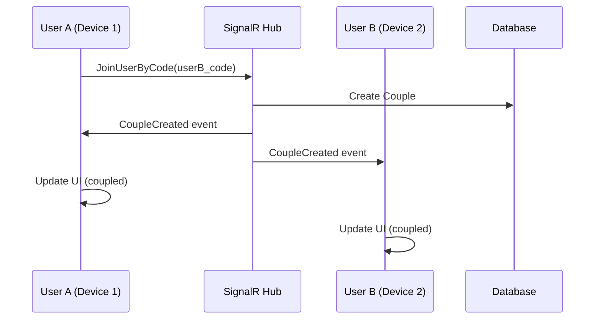
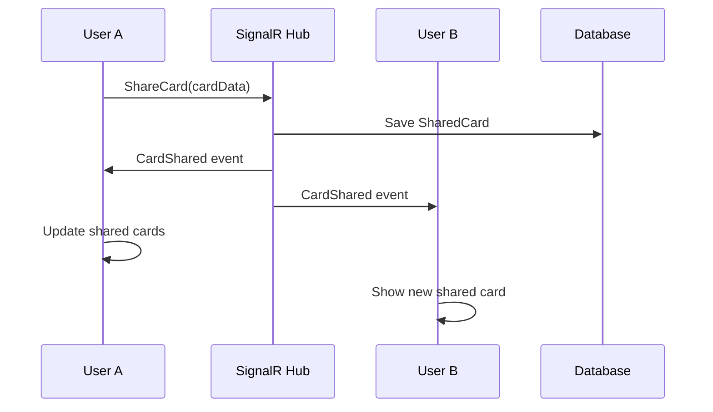

# Real Backend Integration Guide

## Architecture Overview

The Gioco della Complicità app now supports three backend modes:

1. **Real Backend** (ASP.NET Core + SignalR) - **RECOMMENDED for production**
2. **Simulated Backend** (BroadcastChannel) - For development/testing
3. **LocalStorage Backend** - Fallback for incognito mode

## Real Backend Architecture

```
┌─────────────────────────────────────────────────────────────────┐
│                          Frontend (React)                        │
├─────────────────────────────────────────────────────────────────┤
│ ┌─────────────────┐ ┌─────────────────┐ ┌─────────────────┐   │
│ │   Device 1      │ │   Device 2      │ │   Device N      │   │
│ │   (Browser)     │ │   (Mobile)      │ │   (Tablet)      │   │
│ └─────────────────┘ └─────────────────┘ └─────────────────┘   │
│            │                  │                  │              │
│            └──────────────────┼──────────────────┘              │
│                               │                                 │
├─────────────────────────────────────────────────────────────────┤
│                        SignalR Client                            │
│                    (@microsoft/signalr)                         │
└─────────────────────────────────────────────────────────────────┘
                               │
                    WebSocket/HTTP Connection
                               │
┌─────────────────────────────────────────────────────────────────┐
│                    ASP.NET Core Backend                          │
├─────────────────────────────────────────────────────────────────┤
│ ┌─────────────────┐ ┌─────────────────┐ ┌─────────────────┐   │
│ │   SignalR Hub   │ │   REST API      │ │   Services      │   │
│ │   (GameHub)     │ │   Controllers   │ │   Layer         │   │
│ └─────────────────┘ └─────────────────┘ └─────────────────┘   │
│            │                  │                  │              │
│            └──────────────────┼──────────────────┘              │
│                               │                                 │
├─────────────────────────────────────────────────────────────────┤
│                      Entity Framework                            │
│                        (Database)                               │
└─────────────────────────────────────────────────────────────────┘
                               │
                       SQLite Database
                        (game.db)
```

## Benefits of Real Backend

### 🌐 True Multi-Device Support
- **Cross-device synchronization**: Users on different devices see each other in real-time
- **No incognito limitations**: Works in private browsing mode
- **Reliable presence**: Users' online status is managed centrally

### 📊 Centralized State Management
- **Single source of truth**: All user, couple, and session data stored in database
- **Persistent sessions**: Sessions survive page reloads and device switches
- **Shared history**: Game history persists across devices and sessions

### 🔄 Real-time Features
- **Instant updates**: SignalR provides real-time bidirectional communication
- **Live chat**: Messages appear instantly on all connected devices
- **Shared canvas**: Drawing and notes sync in real-time
- **Card sharing**: Cards shared by one user appear immediately for others

### 🎯 Enhanced Features
- **User presence**: See when partner comes online/offline
- **Message history**: Full chat history persisted in database
- **Game analytics**: Track cards played, session duration, etc.
- **Reconnection handling**: Automatic reconnection after network issues

## Backend Components

### 1. SignalR Hub (GameHub.cs)
Real-time message broker handling:
- User registration and authentication
- Couple creation and management
- Game session lifecycle
- Chat messages and card sharing
- User presence and heartbeat

### 2. Services Layer
- **UserService**: User management, presence, authentication
- **CoupleService**: Couple creation, joining, status management
- **GameSessionService**: Session lifecycle, participants, state
- **CardService**: Game cards repository and random selection

### 3. Database Models
- **User**: Name, personal code, game type, presence
- **Couple**: Partner relationship, creation date, status
- **GameSession**: Active game state, participants, messages
- **GameCard**: Question cards for different game types
- **SharedCard**: Cards shared during sessions

### 4. REST API Endpoints
- `/api/health` - Backend health check
- `/api/users` - User management
- `/api/couples` - Couple operations
- `/api/sessions` - Game session management
- `/api/cards` - Card operations

## Frontend Integration

### 1. Backend Detection (`EnhancedAutoBackendDetection.js`)
Automatically detects the best available backend:
```javascript
// Priority order:
1. Real Backend (ASP.NET Core) - if available
2. Simulated Backend (BroadcastChannel) - if real backend unavailable
3. LocalStorage - fallback for incognito mode
```

### 2. Real Backend Hook (`useRealBackend.js`)
React hook wrapping SignalR communication:
- Connection management
- Event handling
- State synchronization
- Error handling and reconnection

### 3. SignalR Service (`RealBackendService.js`)
Low-level SignalR client wrapper:
- WebSocket connection
- Event emission and listening
- Automatic reconnection
- Message serialization

## Setup Instructions

### 1. Backend Setup
```bash
# Navigate to backend directory
cd Backend/ComplicityGame.Api

# Restore packages
dotnet restore

# Build the project
dotnet build

# Run the backend
dotnet run
```

Backend will start on:
- HTTP: `http://localhost:5000`
- HTTPS: `https://localhost:5001`

### 2. Frontend Setup
```bash
# Navigate to frontend directory
cd /home/fabio/CardApp

# Install dependencies (SignalR already included)
npm install

# Start development server
npm run dev
```

### 3. Testing Multi-Device
1. Start the ASP.NET Core backend
2. Start the React frontend
3. Open multiple browser windows/devices
4. Register users and create couples
5. Verify real-time synchronization

## Message Flow Example

### Creating a Couple


### Sharing a Card


## Production Considerations

### Security
- [ ] Add authentication middleware
- [ ] Implement user session validation
- [ ] Add rate limiting for API endpoints
- [ ] Use HTTPS in production

### Scalability
- [ ] Consider Redis for SignalR backplane (multiple server instances)
- [ ] Implement database connection pooling
- [ ] Add caching for frequently accessed data
- [ ] Monitor SignalR connection limits

### Monitoring
- [ ] Add structured logging
- [ ] Implement health checks
- [ ] Monitor SignalR connection metrics
- [ ] Track user engagement analytics

### Deployment
- [ ] Configure production database (PostgreSQL/SQL Server)
- [ ] Set up reverse proxy (nginx/IIS)
- [ ] Configure SSL certificates
- [ ] Set up CI/CD pipeline

## Migration from Client-Side

The real backend provides a complete replacement for the current client-side architecture:

| Feature | Client-Side | Real Backend |
|---------|-------------|--------------|
| Multi-device | ❌ Limited | ✅ Full support |
| Incognito mode | ❌ Broken | ✅ Works |
| Persistence | ❌ LocalStorage only | ✅ Database |
| Real-time sync | ❌ BroadcastChannel only | ✅ SignalR |
| Scalability | ❌ Single device | ✅ Multiple devices |
| Reliability | ❌ Client-dependent | ✅ Server-managed |

## Testing Checklist

### Real Backend Mode
- [ ] Users can register and login
- [ ] Partner joining works across devices
- [ ] Online status syncs in real-time
- [ ] Messages appear instantly on all devices
- [ ] Cards sharing works across devices
- [ ] Sessions persist across page reloads
- [ ] Reconnection works after network issues

### Fallback Modes
- [ ] Falls back to simulated backend when real backend unavailable
- [ ] Falls back to localStorage in incognito mode
- [ ] UI indicates current backend mode
- [ ] Error messages are helpful

This real backend architecture provides a production-ready foundation for true multi-device, real-time gaming experience!
