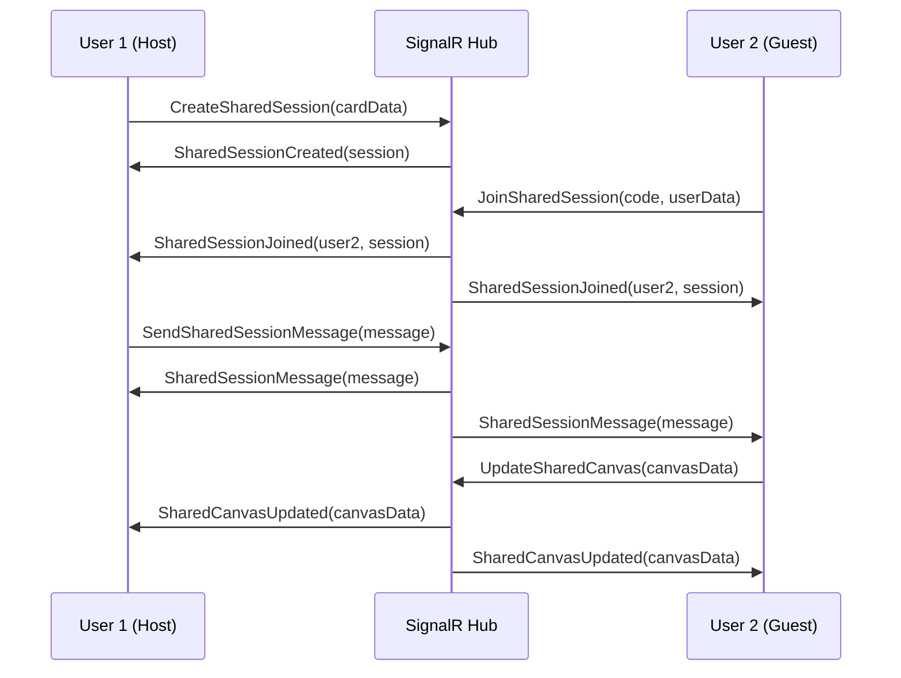

# 🎮 Sessioni Condivise - Documentazione Tecnica

## 🎯 Panoramica
Le **Sessioni Condivise** permettono a due partner di condividere una carta del Gioco della Complicità e interagire insieme in tempo reale attraverso:

- **Chat collaborativa** per discutere le domande
- **Canvas condiviso** per disegnare e prendere note
- **Sincronizzazione real-time** di tutti gli stati

## 🏗️ Architettura

### Frontend Components
```
📁 Frontend/
├── 🧩 SharedSession.jsx          # Interfaccia principale della sessione
├── 💬 CollaborativeChat.jsx      # Chat in tempo reale
├── 🎨 CollaborativeCanvas.jsx    # Canvas collaborativo
├── 🎣 useSharedSession.js        # Hook di gestione stato
├── 📤 ShareCardModal.jsx         # Modal condivisione (aggiornato)
└── 🧪 SharedSessionTestButton.jsx # Componente di test
```

### Backend API
```
📁 Backend/
├── 🔌 GameHub.cs                 # SignalR Hub (metodi sessioni condivise)
├── 🎮 CreateSharedSession()      # Crea sessione
├── 🚪 JoinSharedSession()        # Unisciti alla sessione
├── 💬 SendSharedSessionMessage() # Invia messaggio chat
├── 🎨 UpdateSharedCanvas()       # Aggiorna canvas
└── 🛑 EndSharedSession()         # Termina sessione
```

## 🚀 Utilizzo

### 1. Creazione Sessione
```javascript
// L'utente pesca una carta e clicca "Condividi Carta"
// Nel modal, seleziona "🎯 Crea Sessione Real-Time"
const result = await createSharedSession(card, currentUser);
console.log('Codice sessione:', result.sessionCode); // es. "A3X7K9"
```

### 2. Unirsi alla Sessione
```javascript
// Il partner inserisce il codice condiviso
await joinSharedSession("A3X7K9", partnerUser);
```

### 3. Interazione Real-Time
```javascript
// Invio messaggi
sendMessage("Interessante questa domanda!", currentUser);

// Aggiornamento canvas
updateCanvas(canvasImageData, currentUser);
```

## 🔄 Flusso di Comunicazione

### SignalR Events


## 🧪 Testing

### Test Button
È disponibile un pulsante di test nell'interfaccia (angolo in basso a sinistra) per testare:
- ✅ Creazione sessioni
- ✅ Unirsi a sessioni via codice
- ✅ Invio messaggi
- ✅ Aggiornamenti canvas
- ✅ Terminazione sessioni

### Test Manuale
1. **Apri due tab del browser** su `http://localhost:5173`
2. **Tab 1**: Accedi → Pesca carta → Condividi → Crea Sessione Real-Time
3. **Copia il codice** mostrato (es. "A3X7K9")
4. **Tab 2**: Accedi → Click "🎮 Unisciti" (in alto a destra) → Inserisci codice
5. **Interagisci** via chat e canvas in entrambi i tab

## 📊 Stato della Implementazione

### ✅ Completato
- [x] Hook `useSharedSession` per gestione stato
- [x] Componenti UI (SharedSession, Chat, Canvas)
- [x] Backend SignalR (GameHub metodi)
- [x] Integrazione con ShareCardModal
- [x] Generazione codici sessione
- [x] Sincronizzazione real-time
- [x] Componenti di test

### 🔄 In Corso
- [ ] Persistence sessioni nel database
- [ ] Gestione disconnessioni/riconnessioni
- [ ] Notifiche push per inviti

### 🎯 Prossimi Sviluppi
- [ ] **Inviti diretti**: Invita partner specifico invece di codice
- [ ] **Storia sessioni**: Salva le sessioni completate
- [ ] **Esportazione**: Salva chat + canvas come PDF
- [ ] **Reazioni**: Emoji reactions ai messaggi
- [ ] **Voice chat**: Integrazione chiamate audio
- [ ] **Modalità presenter**: Un utente controlla, l'altro osserva

## 🔧 Configurazione Tecnica

### Frontend Dependencies
```json
{
  "@microsoft/signalr": "^8.0.0",
  "react": "^18.0.0"
}
```

### Backend Configuration
```csharp
// Program.cs
builder.Services.AddSignalR();
app.MapHub<GameHub>("/gamehub");
```

### Ports
- **Frontend**: http://localhost:5173
- **Backend**: http://localhost:5000
- **SignalR Hub**: ws://localhost:5000/gamehub

## 🐛 Debug e Troubleshooting

### Errori Comuni

#### 1. "Backend non disponibile"
```bash
# Verifica che il backend sia in esecuzione
lsof -i :5000
cd Backend/ComplicityGame.Api && dotnet run
```

#### 2. "Sessione non trovata"
- Verifica che il codice sia corretto (6 caratteri maiuscoli)
- Controlla che l'host non abbia terminato la sessione

#### 3. "Canvas non si sincronizza"
- Verifica che entrambi gli utenti siano nella stessa sessione
- Controlla la console del browser per errori SignalR

### Log Debug
```javascript
// Abilita log dettagliati
localStorage.setItem('debug', 'shared-session:*');
```

## 🎨 Personalizzazione

### Temi Canvas
```javascript
const themes = {
  romantic: ['#FF6B9D', '#C44569', '#F8B500'],
  calm: ['#6C5CE7', '#74B9FF', '#00CEC9'],
  warm: ['#FDCB6E', '#E17055', '#D63031']
};
```

### Emoji Personalizzate
```javascript
const sessionEmojis = ['🎮', '💕', '🎯', '🌟', '💫', '🎪'];
```

---

**✨ La funzionalità "Sessioni Condivise" trasforma la condivisione carte da un'azione statica a un'esperienza collaborativa dinamica e coinvolgente!**
